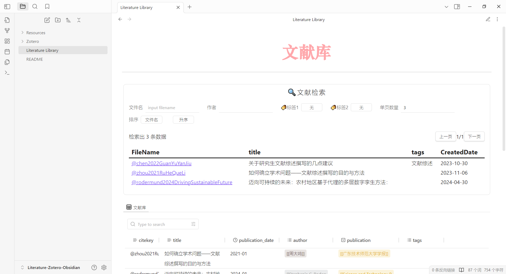
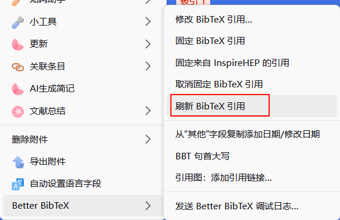
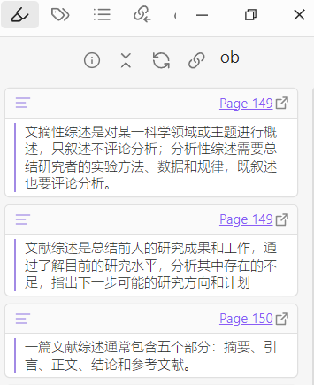
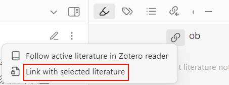
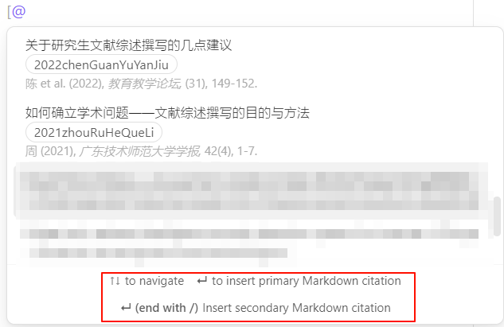

# Literature-Zotero-Obsidian
本库仅探讨obsidian与zotero联动方案

## 效果


![recording.gif]](./Resources/assets/recording.gif)

## 插件
理论上zotero6也能用

### Zotero（7-beta.115）
- Better BibTex for Zotero（6.7.218）
	- https://github.com/retorquere/zotero-better-bibtex/releases/latest
- Obsidian Note for Zotero（1.0.1）
	- https://github.com/PKM-er/obsidian-zotlit/releases/tag/zt1.0.1

### Obsidian
- components（1.6.0）
- dataview（0.5.67）
- zotero integration（3.1.8）
- zotlit（1.1.8）

## 使用说明
### 插件设置
`Better BibTex for Zotero`插件用于个性化设置citekey，引用配置是

```
# 这里是第一作者的姓+发表年份+标题的前四个字母
auth.transliterate.lower+year+shorttitle.ideographs.capitalize.select(1,4)
```

修改引用之后需要全选所有文献，右键选择`刷新bibtex引用`



`Obsidian Note for Zotero`插件是用于zotlit插件连接Zotero和Obsidian，无须额外设置

`components`和`dataview`插件用于构建文件检索器

`zotero integration`插件用于导入文献，以及提供文献信息

`zotlit`插件用于在侧边显示当前文献的标注，快速在文档中引用文献

### 如何使用`zotero integration`导入文献
首先保证zotero已打开

在obsidian中按下`ctrl p`，选择`Zotero Integration:Import Literature`，在zotero弹出的选择框中选择需要导入的文献（选择框建议更改为经典视图，默认是一个搜索框）

### 如何使用`zotlit`查看文献标注
展开右侧边栏，选择笔刷图案的按钮（如果没有则使用`ctrl p`搜索`ZotLit: Open Zotero annotation view inside panel`）

如果需要将标注放在文献笔记中，则打开一篇文献，右侧就会显示该文献的标注


如果需要在其他笔记中引用标注，则选择`Link with selected literature`


### 如何使用`zotlit`快速引用
在笔记中输入`[@`之后会出现一个文献选择框，这时确定会按照首选格式来生成引用，如果需要使用第二种引用格式则在输入`[@/`然后再来选择文



### 如何更改模板
`Resources/plugin/_ZoteroIntegration/literature.md`是`Zotero Integration`插件的导入模板，按需更改。

`Resources/plugin/_Zotlit`下的文件是`Zotlit`插件的模板，具体作用可查看https://github.com/RavenHogWarts/Snippets/blob/master/Obsidian/ZotLit.md

在obsidian中按下`ctrl p`，搜索并选择`Zotero Integration:Data explorer`，使用`Prompt For Selection`选择一篇文献可以打开文献的数据列表


